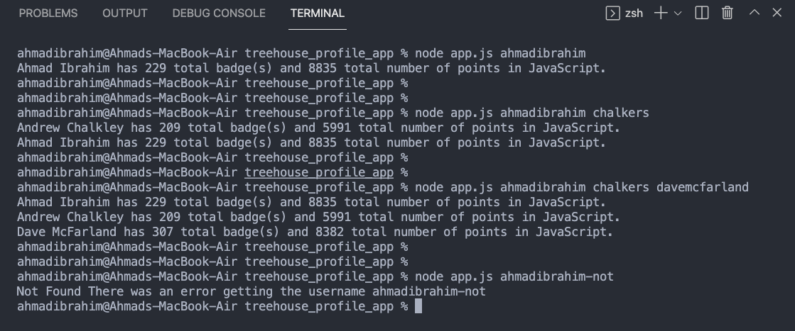

# treehouse_profile_app

This application uses node.js to display a users treehouse application, retrieving data from treehouses user profile api

## Example

## app.js

App.js takes in arguments from the command line and uses the profile.js export to fetch user information from the treehouse api

## profile.js

Profile.js exports the get funcion that connects to the api and retrieves the data for each user passed in as arguements

- [treehouse_profile_app](#treehouse_profile_app)
  - [Example](#example)
  - [app.js](#appjs)
  - [profile.js](#profilejs)
